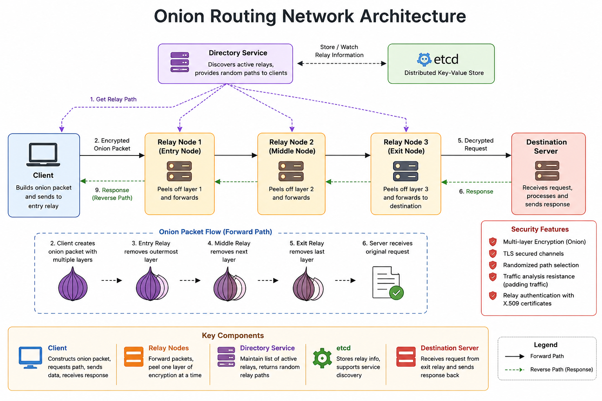

# Onion Routing Network

A Tor-inspired anonymous communication network built in Go using multi-hop onion encryption, gRPC, TLS, and etcd-based relay discovery.

---

## Architecture

<p align="center">
  
</p>

The client constructs a multi-layer encrypted onion packet and forwards it through a randomly selected path of relay nodes. Each relay removes one encryption layer before forwarding the packet to the next hop. The exit relay communicates with the destination server and returns the response through the same circuit.

---

## Overview

This project implements an onion routing network that enables clients to communicate with destination servers through multiple relay nodes without revealing the complete communication path to any single participant.

The system combines:

* Multi-hop relay routing
* Layered ("onion") encryption
* Distributed relay discovery using etcd
* Mutual TLS authentication
* Randomized circuit construction
* Traffic-analysis resistance through padding traffic
* Adaptive relay selection using load information

The architecture is inspired by the core ideas behind the Tor network while remaining lightweight and educational.

---

## Key Features

### Multi-Layer Onion Encryption

Each relay decrypts only its own encryption layer.

As a result:

* Entry relay knows the client but not the destination
* Exit relay knows the destination but not the client
* Intermediate relays know neither endpoint

---

### Hybrid Cryptography

| Purpose              | Algorithm          |
| -------------------- | ------------------ |
| Key Exchange         | RSA-4096           |
| Payload Encryption   | RC4                |
| Transport Security   | TLS                |
| Relay Authentication | X.509 Certificates |

---

### Randomized Circuit Construction

Clients build circuits through randomly selected relays.

Benefits:

* Improves anonymity
* Reduces route predictability
* Makes correlation attacks more difficult

---

### Traffic Analysis Resistance

Relay nodes periodically generate padding traffic.

This creates:

* Dummy packets
* Additional network noise
* Reduced effectiveness of timing attacks

---

### Adaptive Relay Selection

Relay nodes publish load information through etcd.

Clients can select routes that:

* Avoid overloaded nodes
* Improve latency
* Distribute traffic more evenly

---

### Service Discovery with etcd

Relay nodes dynamically register themselves in etcd.

The system automatically:

* Discovers active relay nodes
* Removes expired nodes using leases
* Monitors relay availability

---

### Secure Transport

All communication channels are protected using TLS.

This prevents:

* Passive packet inspection
* Relay impersonation
* Man-in-the-middle attacks

---

## Project Structure

```text
.
├── client/                # Client implementation
├── relay/                 # Relay node implementation
├── server/                # Destination server
├── encryption/            # Cryptographic primitives
├── protofiles/            # Protocol Buffer definitions
├── utils/                 # Shared utilities
├── scripts/
│   └── generate_certificates.sh
├── assets/
│   └── architecture.png
├── logs/
├── Makefile
├── go.mod
└── README.md
```

---

## Technologies Used

* Go
* gRPC
* Protocol Buffers
* etcd
* TLS
* RSA-4096
* Concurrent Programming
* Distributed Systems
* Applied Cryptography
* Onion Routing Concepts

---

# Getting Started

## Prerequisites

### Go

Install Go:

https://go.dev/dl/

Verify installation:

```bash
go version
```

---

### Protocol Buffers

Install protoc:

https://protobuf.dev/downloads/

Verify installation:

```bash
protoc --version
```

---

### etcd

Install etcd:

https://etcd.io/docs/

Verify installation:

```bash
etcd --version
```

---

# Setup

## Clone Repository

```bash
git clone https://github.com/siddharth-ag2004/DS-Project-Onion-Routing.git

cd DS-Project-Onion-Routing
```

---

## Install Dependencies

```bash
go mod tidy
```

---

## Generate TLS Certificates

Certificates are intentionally not tracked by Git.

Generate fresh certificates:

```bash
cd scripts

chmod +x generate_certificates.sh

./generate_certificates.sh

cd ..
```

This creates:

```text
certificates/
├── ca.crt
├── ca.key
├── client.crt
├── client.key
├── relay_node.crt
├── relay_node.key
├── server.crt
└── server.key
```

---

## Generate gRPC Files

```bash
make proto
```

---

# Running the System

Open separate terminal windows.

---

## Terminal 1 — Start etcd

```bash
make etcd
```

---

## Terminal 2 — Start Destination Server

```bash
make server
```

---

## Terminal 3 — Start Relay Node 1

```bash
export SSLKEYLOGFILE=$(pwd)/tmp/sslkeys.log

make relay RELAY_NODE_ID=1
```

---

## Terminal 4 — Start Relay Node 2

```bash
export SSLKEYLOGFILE=$(pwd)/tmp/sslkeys.log

make relay RELAY_NODE_ID=2
```

---

## Terminal 5 — Start Relay Node 3

```bash
export SSLKEYLOGFILE=$(pwd)/tmp/sslkeys.log

make relay RELAY_NODE_ID=3
```

---

## Terminal 6 — Run Client

```bash
make client CLIENT_ID=1001
```

---

## Client Requests

After the circuit is established, the client prompts:

```text
Enter Request Type:
```

Available request types:

| Request Type | Operation                    |
| ------------ | ---------------------------- |
| 1            | Greeting Request             |
| 2            | Compute nth Fibonacci Number |
| 3            | Generate Random Number      |
| 0            | Exit Client                  |

Example:

```text
Enter Request Type: 1
Response received from server(Decrypted): Welcome, This is Onion-Routing Server

Enter Request Type: 2
Enter n for Fibonacci: 10
Response received from server(Decrypted): 55

Enter Request Type: 3
Enter n for random numbers: 4
Response received from server(Decrypted): 3, 31, 47, 44

Enter Request Type: 0
Exiting Client
```

---

## Example Workflow

1. Relay nodes register with etcd.
2. Client discovers active relay nodes.
3. Client randomly selects a relay path.
4. A multi-layer onion-encrypted circuit is created.
5. The request traverses multiple relays.
6. Each relay decrypts exactly one layer.
7. The exit relay contacts the destination server.
8. The response travels back through the same circuit.
9. The client decrypts all response layers and displays the result.

---

## Cleaning Logs

```bash
make clean_logs
```

---

## Author

**Siddharth Agarwal**

GitHub: https://github.com/siddharth-ag2004
